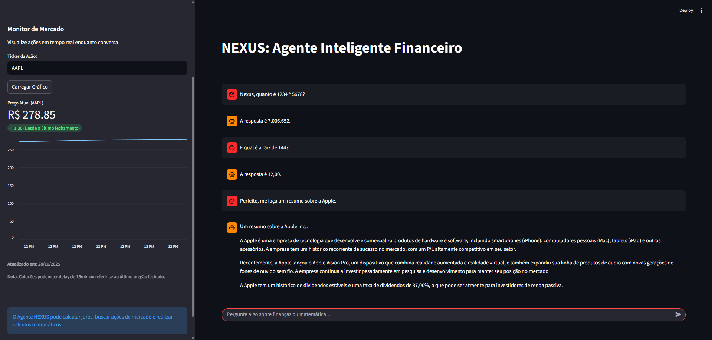
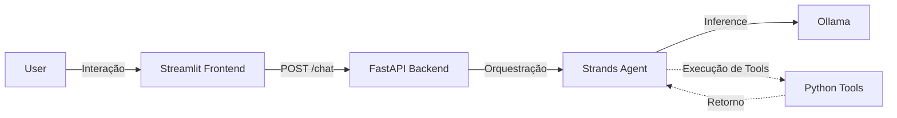

# 🤖 NEXUS Financial Agent

> **Case Técnico Dreamsquad — Agente Financeiro com Ferramentas e Orquestração LLM**


O **NEXUS Financial Agent** é um agente de IA projetado para cálculos financeiros, matemática geral e consultas de mercado (ações) utilizando ferramentas Python e orquestração via **Strands Agents SDK**.

O sistema combina:

- **Backend em FastAPI**
- **Frontend em Streamlit** 
- **Raciocínio estruturado com Few-Shot e TOON**
- **LLM local via Ollama** 



---

# Arquitetura do Projeto

O sistema é dividido em duas camadas principais:

### **1. Backend — FastAPI**
- Expõe o endpoint POST `/chat`
- Organiza o fluxo LLM → ferramentas → resposta
- Usa Strands Agents SDK para criação do agente

### **2. Frontend — Streamlit**
- Interface gráfica de chat
- Exibição de gráficos (ações) em dashboard
- Comunicação com API via HTTP

---

# 🔄 Fluxo de Dados



---

# ROADMAP
### Converter o agente em um sistema cognitivo de gastos pessoais e investimentos.
- [ ] Memória SQLite para gastos e investimentos;
- [ ] Dashboard inteligente no app Streamlit (Pie & Bar charts);
- [ ] RAG Documental Agêntico com ChromaDB via upload no Streamlit;
- [ ] Classificação automática com base em orçamentos;
- [ ] Sistema de recomendação inteligente para gastos;
- [ ] Transição modal de Llama3.1 para Qwen2.5, que é superior em matemática.

---

#  Pré-requisitos

Instale:

* **Python 3.10+**
* **Ollama**
* Modelo **Llama 3.1** 

### Instalar o modelo correto:

```bash
ollama pull llama3.1
```

---

# ⚙️ Instalação do Projeto

### 1. Clonar e criar ambiente virtual

```bash
git clone https://github.com/andrecodea/nexus-financial-agent.git
cd nexus-financial-agent

# Windows
python -m venv venv
.\venv\Scripts\activate

# Linux / Mac
python3 -m venv venv
source venv/bin/activate
```

---

### 2. Instalar dependências

```bash
pip install -r requirements.txt
```

---

### 3. Criar arquivo `.env`

Crie um arquivo `.env` na raiz com:

```ini
OLLAMA_HOST=http://localhost:11434
MODEL_NAME=llama3.1
```

---

#  Como Executar

São necessários **dois terminais** com o ambiente virtual ativo.

## Passo 1 — Backend (FastAPI)

```bash
uvicorn app.main:app --reload
```

A API ficará em:

```
http://localhost:8000
```

## Passo 2 — Frontend (Streamlit)

```bash
streamlit run frontend/app.py
```

A interface abrirá em:

```
http://localhost:8501
```

---

#  Exemplos de Uso

| Intenção               | Exemplo                                      | Ferramenta                    |
| ---------------------- | -------------------------------------------- | ----------------------------- |
| Cálculo Matemático     | “Quanto é 1234 × 5678?”                      | `calculate_math_expression`   |
| Funções Math do Python | “Raiz de 144?”                               | `calculate_math_expression`   |
| Preço de ação          | “Preço da PETR4.SA hoje?”                    | `get_ticker_price`            |
| Juros Compostos        | “Quanto rendem 1000 reais por 5 anos a 10%?” | `calculate_compound_interest` |
| Conversa Geral         | “Quem descobriu o Brasil?”                   | Resposta direta               |

---

# 📁 Estrutura do Projeto

```text
nexus-financial-agent/
│
├── app/                   
│   ├── main.py             # Backend FastAPI
│   ├── agent.py            # Configuração do agente e prompts
│   └── tools.py            # Ferramentas de cálculo e mercado
│
├── frontend/               
│   └── app.py              # Interface Streamlit
│
├── .env
├── .gitignore
├── requirements.txt
└── README.md
```

---

# Solução de Problemas

###  `ConnectionRefused`

Verifique se o Ollama está rodando:

```bash
ollama serve
```

###  `llama3:latest does not support tools`

Você está usando o modelo errado. Rode:

```bash
ollama pull llama3.1
```

E confirme no `.env`:

```
MODEL_NAME=llama3.1
```

###  Gráficos não renderizam

Certifique-se de ter instalado `yfinance`:

```bash
pip install yfinance
```

---

#  Testando a API via cURL

```bash
curl -X POST http://localhost:8000/chat \
     -H "Content-Type: application/json" \
     -d '{"message": "Quanto é 5 vezes 5?"}'
```

----
